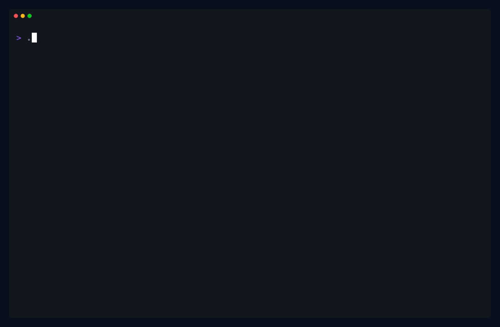

# quest

[](https://github.com/iagopiresdev/quest/actions/workflows/ci.yml)
[](./LICENSE)

CLI-first orchestration for planning, running, validating, and integrating spec-driven agent work.

`quest` gives an operator a local control plane for parallel coding agents: define the work as a typed spec, assign it to registered workers, run isolated workspaces, validate the result, and land the integrated change when the source checkout is ready.

<p align="center">
  
</p>

## What It Does

- Plans work from JSON or YAML specs.
- Registers workers with roles, backend metadata, runtime settings, trust, and calibration history.
- Runs builder and tester lanes through local workspaces.
- Supports `local-command`, Codex CLI, Hermes/OpenAI-compatible HTTP, and OpenClaw CLI backends.
- Integrates completed runs in a dedicated worktree before landing into the source checkout.
- Emits typed observability events to webhook, Telegram, Slack, Linear, or OpenClaw sinks.
- Keeps JSON output as the stable automation contract while pretty output stays human-readable.

## Install From Source

Quest is Bun-first. Use Bun `1.3.9` or newer.

```sh
git clone https://github.com/iagopiresdev/quest.git
cd quest
bun install --frozen-lockfile
bun run build
bun run install:local
quest --pretty
```

## Platform And Release Status

Quest is pre-1.0 and source-first. The repository is public, but no public package registry release is guaranteed yet.

The supported CI platforms are Linux and macOS with Bun `1.3.9` or newer. Native Windows support is not claimed yet; use WSL only as an unvalidated local path.

See [Release And Platform Support](./docs/release-platform-support.mdx) for backend support levels and release expectations.

Preview the docs locally with:

```sh
bun run docs:dev
```

## First Worker

Register the first backend during setup:

```sh
quest setup --yes --backend codex
quest doctor --json
```

Other supported setup targets:

```sh
quest setup --yes --backend hermes --hermes-base-url http://127.0.0.1:8000/v1
quest setup --yes --backend openclaw
quest setup --yes --backend standalone
```

When flags are omitted, setup tries to import trustworthy local defaults such as Codex login state, Hermes `/models`, OpenClaw agents, and sink auth environment variables.

## Core Workflow

Create a spec:

```json
{
  "version": 1,
  "workspace": "project-health",
  "title": "Add project health command",
  "summary": "Expose a CLI command that summarizes repo health checks.",
  "slices": [
    {
      "id": "health-command",
      "title": "Implement health command",
      "goal": "Add the command, tests, and docs for the health summary.",
      "discipline": "coding",
      "owns": ["src/**", "test/**", "README.md"]
    }
  ]
}
```

Plan it, persist a run, execute, integrate, then land:

```sh
quest plan --file quest.json --pretty
quest run --file quest.json --source-repo /absolute/path/to/repo --pretty
quest runs execute --id <run-id> --auto-integrate --target-ref main
quest runs land --id <run-id> --target-ref main
```

For one-shot execution when the source checkout is clean and full turn-in is intended:

```sh
quest runs execute --id <run-id> --auto-integrate --land --target-ref main
```

## Backends

| Backend | Use it for |
| --- | --- |
| `local-command` | Local subprocess workers, smoke tests, and hermetic canaries. |
| `codex-cli` | Native Codex CLI execution with login reuse or key-backed auth. |
| `hermes-api` | Hermes or OpenAI-compatible HTTP worker execution. |
| `openclaw-cli` | Local OpenClaw agent execution through the installed CLI. |
| `dry-run` | Planning and lifecycle inspection without running worker code. |

Workers can be shaped as `builder`, `tester`, or `hybrid`. Builder and tester policy stay separate so planning and validation decisions remain inspectable.

## Observability

Quest persists run events locally first. Sinks are downstream delivery targets, so a failed webhook or chat notification does not redefine run correctness.

```sh
quest observability sinks list
quest observability webhook upsert --id local-hook --url http://127.0.0.1:3000/events
quest observability telegram upsert --id ops --chat-id 123456789 --parse-mode HTML
quest observability sinks test
quest observability deliveries retry --sink-id local-hook
```

## State

Default state lives outside the repo:

```text
~/.quest/workers.json
~/.quest/runs/
~/.quest/workspaces/
~/.quest/calibrations/
~/.quest/observability/config.json
~/.quest/observability/deliveries.json
~/.quest/settings.json
~/.quest/party-state.json
~/.quest/daemon-config.json
~/.quest/daemon-state.json
~/.quest/parties/
```

Use `QUEST_STATE_ROOT=/path/to/state` for disposable runs and canaries.

## Docs

- [Operator Guide](./docs/operator-guide.mdx) for setup, workflows, recovery, observability, and canaries.
- [Pull Request Workflow](./docs/pull-request-workflow.mdx) for opening PRs, following CI and review comments, Codex review, and maintainer auto-merge.
- [Design System](./docs/design-system.mdx) for project structure, specs, domain boundaries, and documentation rules.
- [Engineering Guide](./docs/engineering-guide.mdx) for typing, linting, runtime invariants, and validation expectations.
- [Feature Specs](./docs/specs) for behavior proposals and versioned design notes.
- [Contributing](./CONTRIBUTING.md), [Security](./SECURITY.md), and [Code of Conduct](./CODE_OF_CONDUCT.md) for public project expectations.

## README Media

The README demo is generated from a tracked VHS tape:

```sh
bun run readme:demo
```

This updates:

```text
docs/assets/readme/quest-demo.gif
docs/assets/readme/quest-demo.png
```

## Development

Run the standard validation gate before committing code changes:

```sh
bun run check
```

Execution, setup, sink, integration, or backend import changes should also pass an appropriate real canary from `scripts/canaries/`.
